# README

# Discussion App
Discussion Appは、BoardごとにTask・コメントを管理し、議論の内容を整理・蓄積できるWebアプリケーションです。

## 解決したい課題

- チャットツールでは議論が流れてしまう
- 議題ごとに情報を整理できない
- タスクと議論が別々に管理されているため、経緯を追いにくい

## アプリ概要

Discussion Appは、テーマごとに議論を整理・蓄積するためのWebアプリケーションです。

Boardごとにタスクを作成し、コメントを通じて意見交換を行うことができます。

ユーザー認証や権限制御を実装しており、作成者のみ編集・削除を行える仕様となっています。

---

## 制作背景

前職では法人営業部に所属し、社内の情報共有にチャットツールを利用していました。

しかし、日々の実績報告や部内のお知らせ、アンケート・テストの締め切りリマインドなど、さまざまな内容が一つのチャットに投稿されるため、情報が整理されず、必要な議論や過去のやり取りを後から見返しにくいという課題がありました。

この課題を解決するため、「議題ごとに情報を整理し、タスク管理とコメントによる議論を一つの場所で行えるアプリケーション」をコンセプトとして Discussion App を開発しました。

Boardごとにテーマを分けて管理し、その中でTaskを作成し、コメントを通じて報告や議論を行える構成とすることで、情報が流れず、後からでも経緯を確認できることを目指しました。

---

## URL

（デプロイ後に追加）

---

## 使用技術

| 分類         | 使用技術                             | 用途                |
| ---------- | -------------------------------- | ----------------- |
| バックエンド     | Ruby 3.3.2 / Ruby on Rails 7.2.3 | Webアプリケーション開発     |
| フロントエンド    | HTML / CSS / Haml / JavaScript   | 画面構築・UI制御         |
| データベース     | PostgreSQL 17.10                       | データ管理             |
| ORM        | Active Record 7.2.3                    | データベース操作          |
| 認証         | Devise 5.0.4                          | ユーザー認証            |
| ファイルアップロード | Active Storage 7.2.3                  | プロフィール画像・Task画像管理 |
| 開発支援       | Bullet 8.1.3 / RuboCop 1.88.0                 | パフォーマンス改善・静的解析    |
| バージョン管理    | Git / GitHub                     | ソースコード管理          |


## 技術選定理由

### バックエンド

#### Ruby

Rubyは可読性が高く、シンプルな文法で記述できるため、開発効率と保守性の両立が可能である点に魅力を感じ採用しました。

また、コードの意図が伝わりやすく、機能追加やリファクタリングを行いやすいことから、継続的な改善を前提としたWebアプリケーション開発に適していると考えました。


#### Ruby on Rails

RailsはMVCアーキテクチャを採用しており、Model・View・Controllerそれぞれの責務を明確に分離できるため採用しました。

本アプリではBoard・Task・Comment・Userなど複数のモデルが関連するため、責務を整理しながら開発を進めることで保守性の高い設計を意識しました。

また、RESTfulルーティングやActive Record、Devise、Active StorageなどRailsが提供する豊富な仕組みを活用することで、実装効率と保守性を両立できると考えました。

---

### フロントエンド

#### HTML・CSS

ユーザーが直感的に操作できる画面を構築するために採用しました。

カードレイアウトを中心としたUIを採用し、Board・Task・プロフィールなどの情報を視覚的に整理することで、必要な情報を把握しやすい画面設計を意識しました。


#### Haml

HTMLを簡潔に記述できるため採用しました。

インデントによる構造表現によりViewファイルの可読性が向上し、コード量を削減できるため、画面数が増えても保守しやすい構成になると考えました。


#### JavaScript

ユーザーの操作性を向上させるため採用しました。

編集・削除メニューの表示など、クリックやホバーに応じて画面を動的に制御することで、必要な情報だけを表示し、シンプルで扱いやすいUIを実現しました。

---

### データベース

#### PostgreSQL

Railsとの親和性が高く、多くのWebサービスで利用されている実績があるため採用しました。

Board・Task・Comment・Userのリレーションを適切に管理し、データの整合性を保ちながら運用できる点も選定理由です。

---

### ORM

#### Active Record

データベース操作をSQLではなくRubyのコードで記述できるため採用しました。

Board・Task・Commentの関連付けを `has_many` や `belongs_to` を利用して実装し、可読性の高いコードでデータ操作を行えるようにしました。

また、Bulletを利用してN+1問題を検出し、`includes` を用いたEager Loadingを実装することで、不要なSQL発行を削減しパフォーマンス改善にも取り組みました。

---

### 認証

#### Devise

ユーザー認証を安全かつ効率的に実装するため採用しました。

ログイン・ログアウト・新規登録など認証機能を短期間で実装できるだけでなく、認証処理をライブラリに任せることで、セキュリティ面も考慮した設計としました。

---

### ファイルアップロード

#### Active Storage

プロフィール画像やTask画像を管理するため採用しました。

Rails標準機能であるため導入コストが低く、画像アップロードから表示までをシンプルに実装できました。

また、画像未設定時にはデフォルト画像を表示することで、画面レイアウトが崩れないよう工夫しています。

---

### その他

#### Bullet

開発段階でN+1問題を検出し、アプリケーションのパフォーマンスを改善するため導入しました。

警告内容をもとに `includes` を利用したEager Loadingを実装し、SQL発行回数を削減しました。

---

#### RuboCop

コードスタイルを統一し、可読性・保守性を向上させるため導入しました。

定期的に静的解析を実施し、コーディング規約に沿ったコード品質を維持することを意識しました。

---

#### Git / GitHub

ソースコードのバージョン管理を行うため利用しました。

機能ごとにブランチを作成し、コミットを細かく分けながら開発を進めることで、変更履歴を追いやすくし、安全に開発できる環境を整えました。


---

## ✨機能一覧

- ユーザー登録・ログイン（Devise）
- プロフィール編集
- Board CRUD
- Task CRUD
- コメント投稿
- 画像アップロード
- 権限制御
- バリデーション
- フラッシュメッセージ


---

## 🛠 技術的な工夫

- Deviseを利用したユーザー認証機能
- Active Storageを利用した画像アップロード機能
- before_actionによる共通処理のリファクタリング
- 権限制御による作成者のみ編集・削除可能な設計
- Bulletを利用したN+1問題の検出・解消
- RuboCopによるコード品質の維持
- ネストしたルーティング
- Active Recordの関連付け
- バリデーション

---

## 💡 工夫した点

### 権限制御
Board・Taskともに作成者のみ編集・削除できるように権限制御を実装しました。

また、UI上でも作成者以外には編集・削除メニューを表示しないことで、操作できない機能を表示しない設計としました。

### パフォーマンス
Bulletを導入してN+1問題を検出し、`includes`によるEager Loadingを実装しました。

これにより不要なSQLの発行を削減し、パフォーマンスを改善しました。

### 保守性
`before_action`を活用して共通処理をまとめ、同じコードを複数箇所に書かないようにしました。

これにより、コードの可読性・保守性を向上させています。

### UI/UX
ユーザーが直感的に操作できるよう、カードレイアウトを採用しました。

また、画像未設定時にはデフォルト画像を表示し、レイアウトが崩れないよう工夫しました。

編集・削除メニューについても、PC・スマートフォン双方で操作しやすい表示方法を意識して実装しました。

### データ設計

Taskは必ずBoardに紐付く設計とし、
ネストしたルーティングを採用しました。

これによりURLだけで
TaskがどのBoardに属しているかを
直感的に把握でき、
RESTfulな設計を意識しました。

また、
ActiveRecordの関連付けを利用することで、
Board削除時の整合性や
Task取得処理をシンプルに実装しています。

---

## ER図

アプリケーションで使用しているデータベース設計です。

- Userは複数のBoardを作成できます。
- Boardには複数のTaskを登録できます。
- Taskには複数のCommentを投稿できます。
- Userはプロフィール画像・Task画像をActive Storageで管理しています。

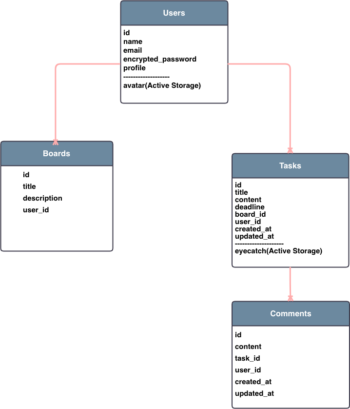


## DB設計

Discussion Appでは、議題ごとに情報を整理できるよう、以下のようなリレーションを採用しました。

- Userは複数のBoardを作成できます。
- Boardは複数のTaskを持つ1対多の関係です。
- Taskは複数のCommentを持ち、議論や進捗報告を蓄積できます。
- UserはBoard・Task・Commentの作成者として紐付いており、権限制御を実現しています。
- プロフィール画像およびTask画像はActive Storageで管理しています。


### 設計で意識したこと

TaskをBoard配下のリソースとして設計することで、「どの議題に属するTaskなのか」を明確にしました。

また、CommentをTaskに紐付けることで、議論の履歴や進捗をTask単位で管理できるようにしています。

各リソースには作成者(User)を関連付け、権限制御を実現しました。

---

## 画面イメージ

### 📋Board一覧

Boardの一覧をカード形式で表示します。
カード右の...をホバー・クリックすると「編集」「削除」ができます。

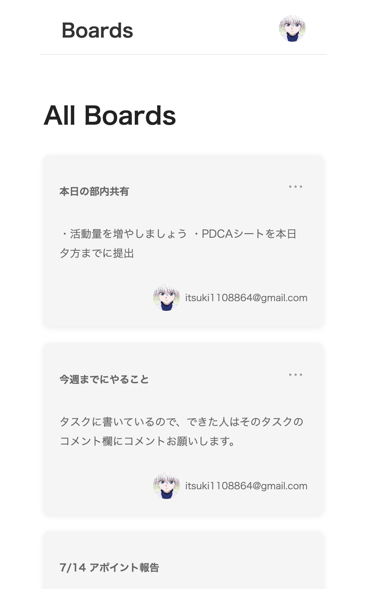

画面一番下には「+Add new board」があり、クリックするとBoard新規作成画面に遷移します。

.png)

また、権限制御を実装しており、Boardの作成者のみ編集・削除メニューが表示されます。
作成者以外のユーザーには「...」メニューは表示されず、編集・削除を行うことはできません。

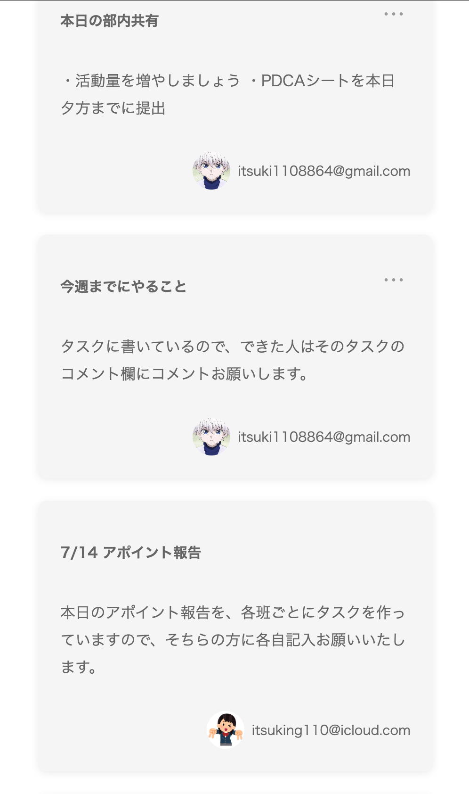


### ➕ Board作成

Boardのタイトルと説明を入力し、新しいBoardを作成できます。


入力内容に不備がある場合は、バリデーションによりエラーメッセージを表示し、正しい入力を促します。（タイトル：3文字以上、内容：10文字以上）

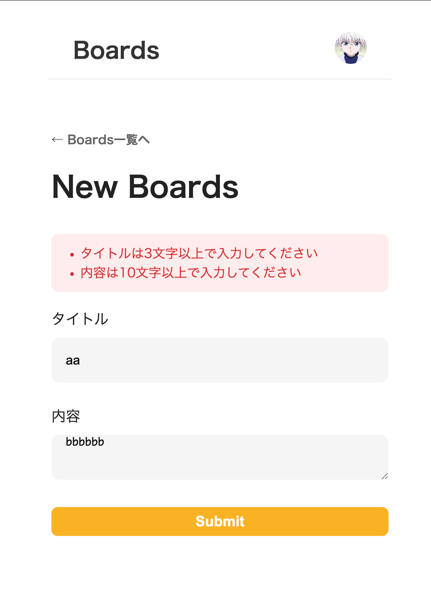

Board作成後は一覧画面へ遷移し、フラッシュメッセージを表示して作成完了を通知します。

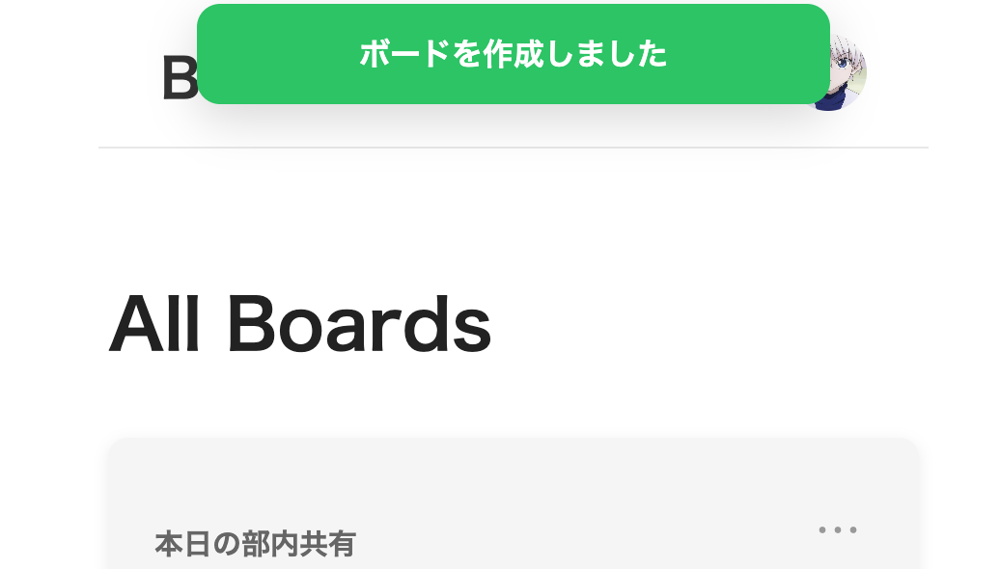


### 📌Board詳細

Boardのタイトル・説明をカード形式で表示します。

この画面でも、Boardの作成者のみカード右上の「⋯」をホバーまたはクリックすることで、編集・削除メニューが表示されます。

また、Boardに紐づくTaskを一覧で表示します。

画面上部の「Board」、Board詳細カード上の「←Boards一覧へ」をクリックすると、Board一覧画面へ遷移します。

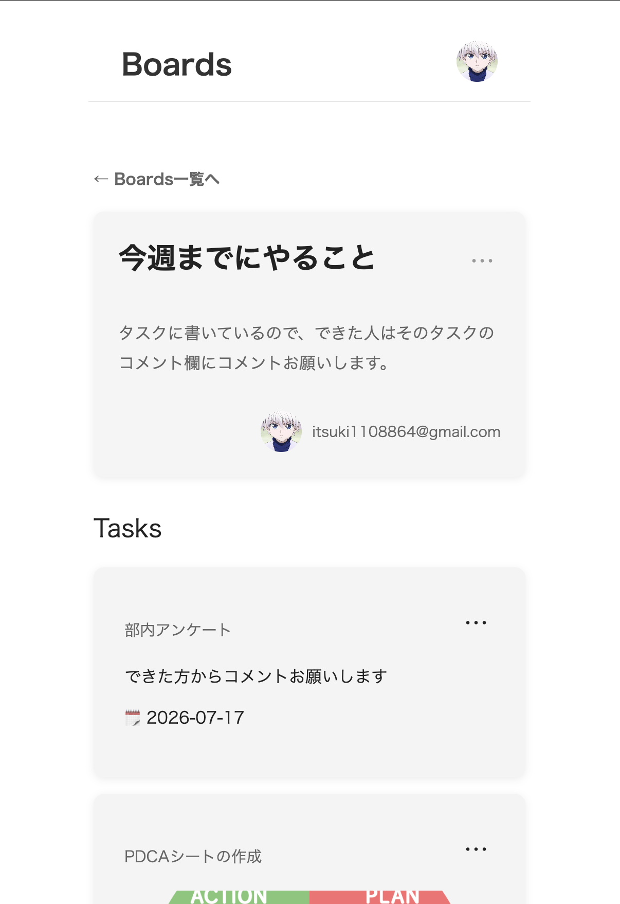

画面下部の 「+ Add new task」 をクリックすると、Task作成画面へ遷移します。

Taskにも権限制御を実装しており、Task作成者のみ「⋯」メニューが表示されます。編集・削除は作成者のみが行うことができます。

.png)

### ➕Task作成

Boardに紐づくTaskを作成できます。

Taskにはタイトル・詳細・期限・画像を設定でき、各Boardごとにタスクを管理できるようにしています。

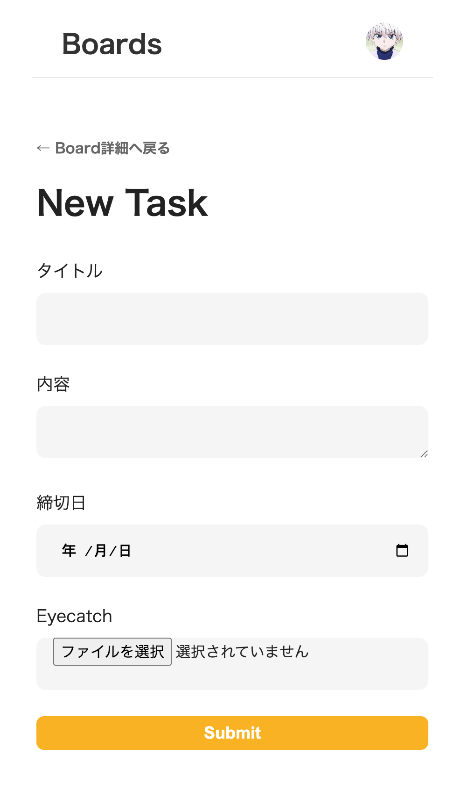

入力内容に不備がある場合は、バリデーションによってエラーメッセージを表示し、正しい入力を促します。

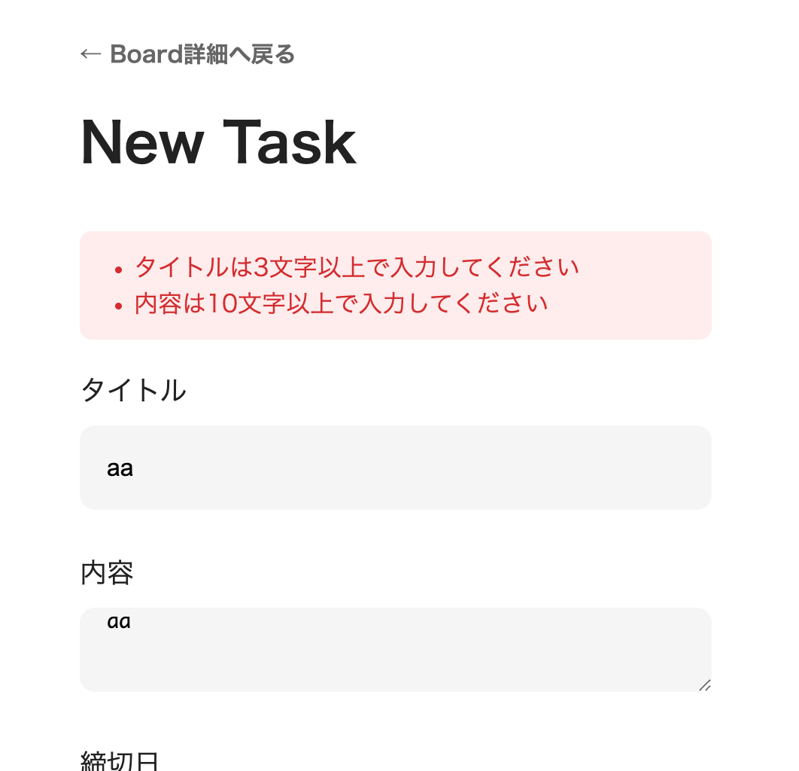

Taskの作成が完了するとBoard詳細画面へ遷移し、作成したTaskが一覧に追加されます。また、フラッシュメッセージによって作成が完了したことをユーザーへ通知します。

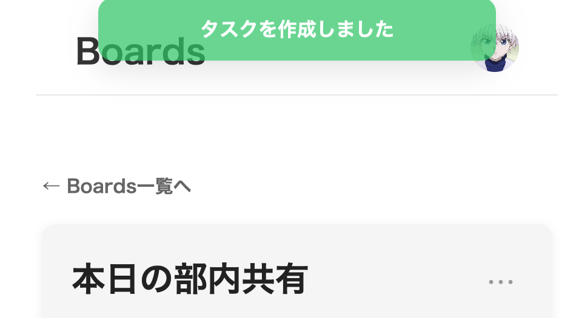


### ✅ Task詳細

Taskのタイトル・詳細・期限・画像を表示します。

Taskに画像を設定した場合は、Active Storageを利用してアップロードした画像を表示できるようにしています。

Task作成者のみ、画面右上の「⋯」をホバーすることで、編集・削除メニューが表示されます。

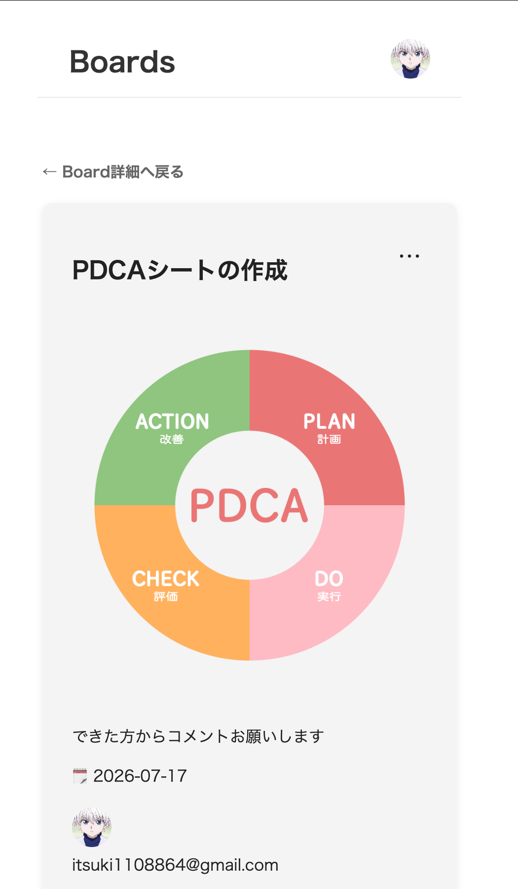

Taskの下部にはコメント一覧を表示し、Taskに対する議論や進捗報告を行うことができます。

コメントを投稿すると、画面上にリアルタイムで追加され、複数人で情報共有できるようにしています。

.png)

コメント投稿後はフラッシュメッセージを表示し、ユーザーが操作結果を確認できるようにしています。

.png)


### 👤 プロフィール

ログインユーザーのプロフィール情報を表示します。

プロフィール画面では、アバター画像・ユーザー名・自己紹介を確認できます。

アバター画像を設定していない場合は、デフォルト画像を表示することでレイアウトが崩れないようにしています。

画面下部の **「プロフィールを編集」** ボタンをクリックすると、プロフィール編集画面へ遷移します。

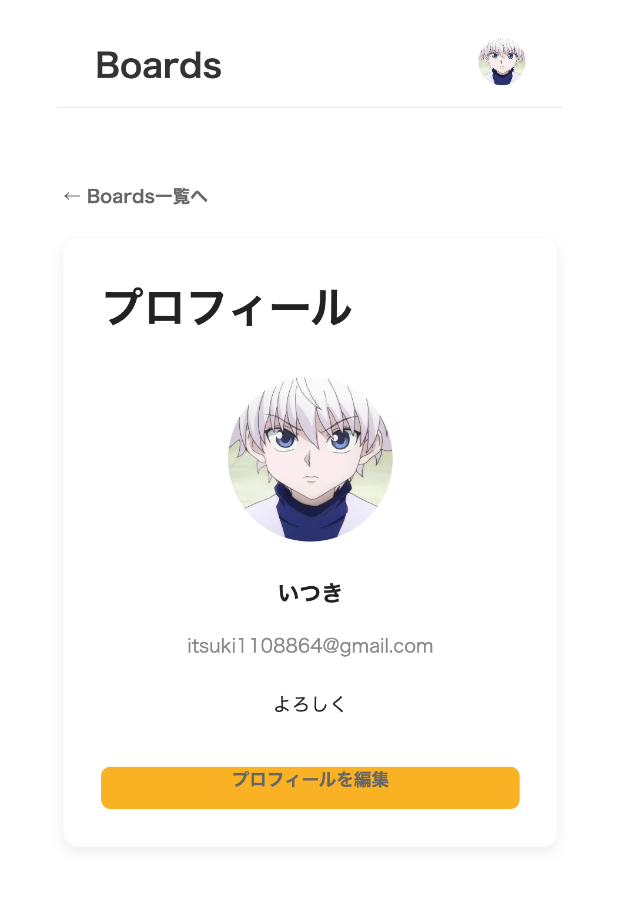


### ✏️ プロフィール編集

プロフィール情報の編集を行うことができます。

ユーザー名・自己紹介・アバター画像を変更でき、自分だけのプロフィールを作成できます。

アバター画像はActive Storageを利用してアップロードしており、画像を変更するとプロフィール画面やBoard一覧などに反映されます。

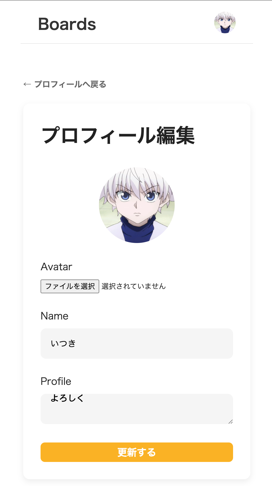

また、ユーザー名と自己紹介にはバリデーションを設定しており、不正な入力が行われた場合はエラーメッセージを表示して入力内容の修正を促します。

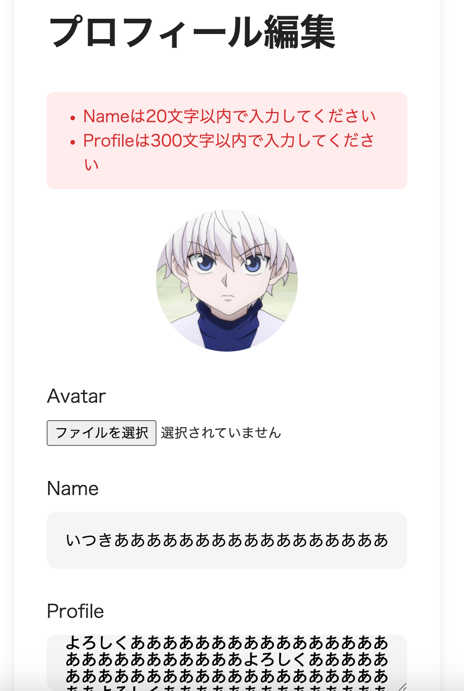

プロフィールの更新が完了するとプロフィール画面へ遷移し、フラッシュメッセージによって更新が完了したことをユーザーへ通知します。

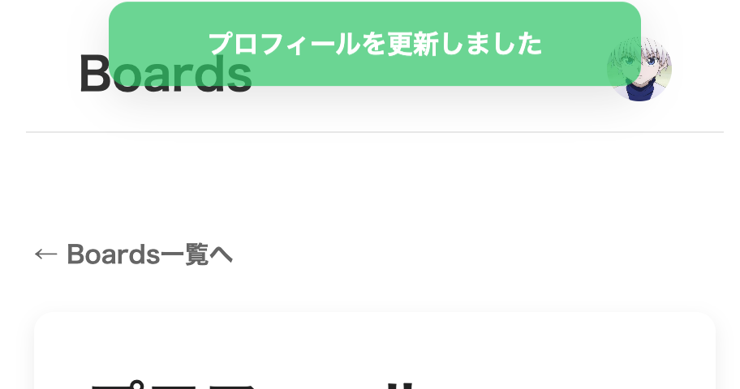


### 🔐 ユーザー認証

Deviseを利用して、ユーザー登録・ログイン・ログアウト機能を実装しています。

新規登録時には、ユーザー名・メールアドレス・パスワードを入力することでアカウントを作成できます。

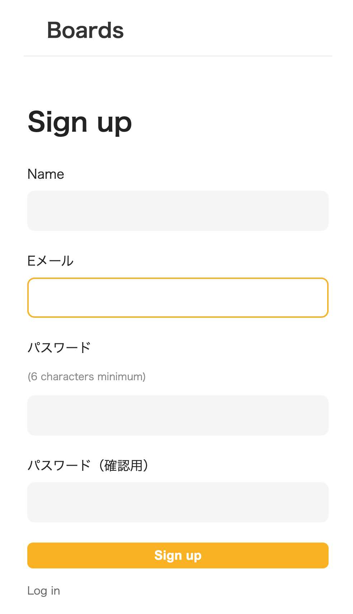

登録済みのユーザーは、メールアドレスとパスワードを入力することでログインできます。

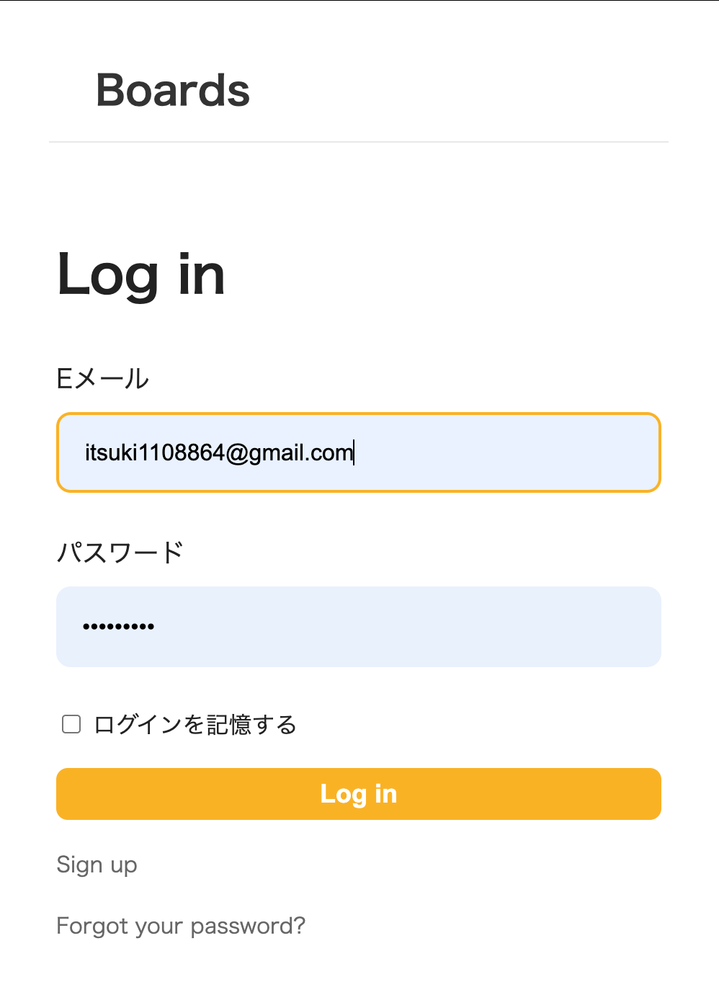

ログイン後は、自身が作成したBoardやTaskの編集・削除が可能となります。一方で、他ユーザーが作成したBoardやTaskは閲覧のみ可能で、編集・削除はできないよう権限制御を実装しています。

また、ログインすると画面上部にフラッシュメッセージが出るようにしています。

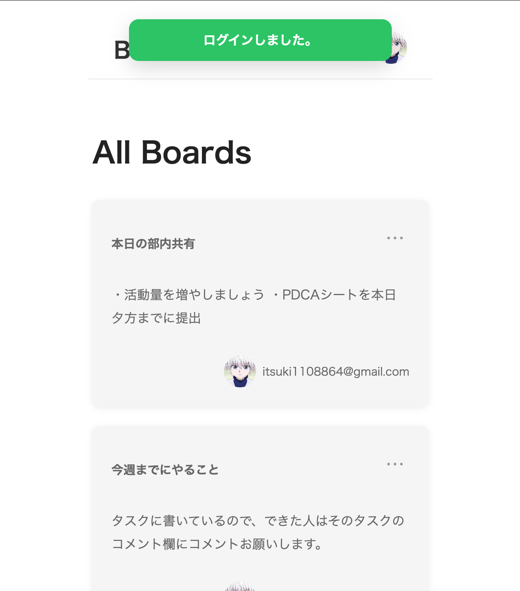


---

## 今後追加したい機能

- コメント編集・削除
  - 投稿後の修正を可能にするため

- Board・Task検索機能
  - Board・Taskを素早く探せるようにするため

- Board・Task並び替え機能（期限順、新着順）
  - 優先度をつけて確認できるようにするため

- 通知機能
  - Board、Task、コメント追加時にユーザーへ通知するため

- ページネーション
  - Boardが増えた際に綺麗に整理するため

- RSpecによるテスト導入
  - 品質を担保し、安全にリファクタリングできるようにするため

---

## セットアップ方法

```bash
git clone ○○
bundle install
bin/rails db:create
bin/rails db:migrate
bin/dev
```

## 学んだこと

本アプリの開発を通して、
RailsのMVCアーキテクチャを意識した設計や、
ActiveRecordによるモデル間の関連付け、
Deviseによる認証機能、
Active Storageを利用した画像管理、
Bulletを利用したパフォーマンス改善など、
Webアプリケーション開発の一連の流れを経験しました。

また、before_actionによる共通処理の切り出しや、
権限制御・バリデーションの実装を通して、
保守性やユーザー体験を意識した開発を学びました。

今後はRSpecによるテストや検索・通知機能などを追加し、
より実践的なWebアプリケーションへ発展させていきたいと考えています。


## 今後の課題

今回実装した機能だけでなく、
検索機能や通知機能、RSpecによるテスト導入などを実装し、
より保守性・実用性の高いアプリケーションへ改善していきたいと考えています。

また、DockerやAWSなどのインフラ技術についても学習を進め、
実務を意識した開発経験を積んでいきたいです。

本アプリではRailsを用いたCRUD・認証・権限制御・画像アップロードなど、Webアプリケーション開発の基本機能を実装しました。今後も機能追加や改善を重ね、より実践的なアプリケーションへ発展させていきます。